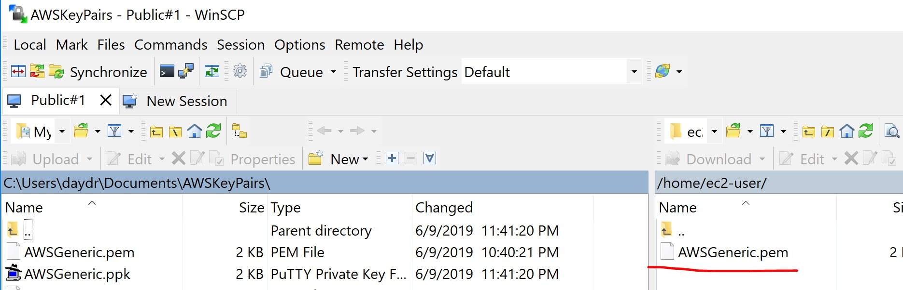

## Goal of this README	

This README's goal is to show the process to construct AWS environment in the configuration below.

 

## 1. Prepare Key Pairs							
Create Key Pairs to be used in the architecture.						

			
 

## 2. Launch VPC 							
Choose option two with create two subnets, one public and the other private.	

Here now, we use NAT instance. Make sure you click "Use a NAT instance instead" and create EC2 instance for NAT ("NAT #2"). 

				
							
## 3. Lunch EC2 instances							

Create 2 instances, one is supposed to put in public subnet ("Public #1") and the other is to put in private subnet ("Private #3").
 
For this README purpose, selection of OS doen't matter. I chose the Linux one.
 						
Do not forget setting VPC Network and Subnet to the created ones in step 2 as follows.	
 	
- Public #1					
	- Auto-assign Public IP = Enable
	- New Security Group (configuration will be done below)					
- Private #3
	- Auto-assign Public IP = Disable
	- Another new Security Group (configuration will be done below)				

## 4. Connect instance Public #1 and check 'ping www.google.com' for connectivity check							
Convert .pem key to .ppk key using PuTTYgen.						
- Load created .pem key.					
- Save private key in the same name but with .ppk extension.

Connect instance using PuTTY.					
- Remember public IP of Public #1.					
- Go Connection > SSH > Auth and set .ppk just created as private key.	

- Set host as ec2-user@<recorded public IP of Public #1> and connect.	

- Check connectivity with Command "ping www.google.com" after landing Public #1.

							
## 5. Copy private key on Public #1							
Using WinSCP, connect to Public #1 and copy .pem key.						
check if it's on Public #1 by 'ls'.		

							
## 6. Security Group configuration							
Here we configure the Security Groups.  

| Security Group of Public #1 |						
| inbound | SSH all (default) |	<- This is only accesible from PuTTY.
		outbound:	All traffic (default)				
							
	Security Group of NAT #2						
		inbound:	All traffic from Security group of Private #3				<- NAT at least needs inbound permission from private instances.
		outbound:	All traffic (default)				
							
	Security Group of Private #3						
		inbound:	SSH all				<- Public #1 can access through this
			All traffic from Security group of NAT #2				
		outbound:	All traffic (default)				
							
Connect instance Private #3 from Public #1 and check ping www.google.com for connectivity check of Private #3							
	On Public #1, do "chmod 400 <.pem private key name just copied to Public #1>".						
	Record the private IP of Private #3.						
	Do ssh -i "<.pem private key name>" ec2-user@<private IP of Private #3 just recorded>						
	Check connectivity 						
		Command "ping www.google.com"					
							
Further extension of architecture							
	Launch instance Private #4 with disabled public IP and the Security Group of Private #3.						
	Confirm if logging in to Private #4 from Public #1 and it can do ping www.google.com.						
		type exit to go back to host, Public #1					
		Do ssh -i "<.pem private key name>" ec2-user@<private IP of Private #4 just recorded>					
		Check connectivity 					
			Command "ping www.google.com"				
							
Clean up							
	Terminate all instances.						
	Security Groups and VPC can be left undeleted.						
	If Elastic IP associated to NAT #2 will not used in other instances, release it.						

