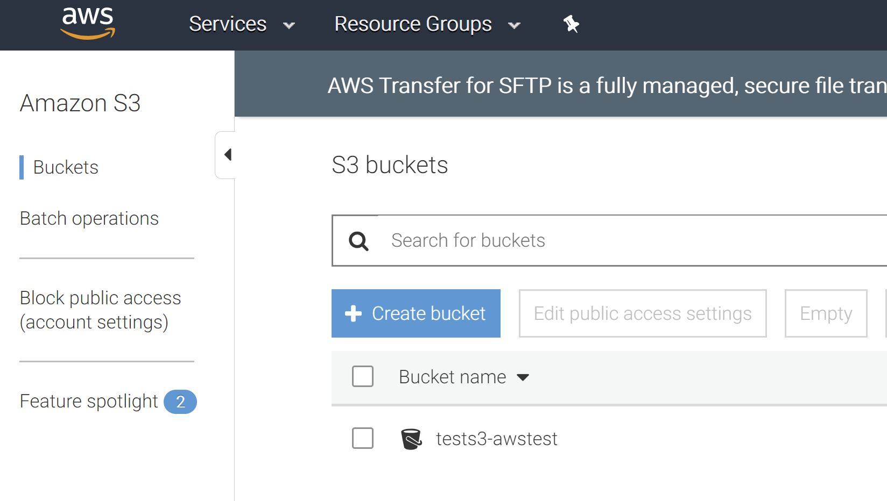

This respository is to keep the records of AWS tricks told in the AWS class.

<br>

# Table of Contents

- [First AWS Architecture with Public and Private Subnets](https://github.com/daydreamersjp/DataScienceTechInstitute/tree/master/AWS#in-class-lab-20190605-first-aws-architecture-with-public-and-private-subnets)
- [Create a Text File in Linux Instance and Push to S3 Bucket](https://github.com/daydreamersjp/DataScienceTechInstitute/tree/master/AWS#in-class-lab-20190612-create-a-text-file-in-linux-instance-and-push-to-s3-bucket)
- [Install R, RServer, Shiny, and Shiny Server on New Instance at Time of Launch](https://github.com/daydreamersjp/DataScienceTechInstitute/tree/master/AWS#in-class-lab-20190612-install-r-rserver-shiny-and-shiny-server-on-new-instance-at-time-of-launch)
- [My Friend @Yuhsuant1994's Excellent Work: Running a Small Face Recognition App on AWS](https://github.com/Yuhsuant1994/DataScienceTechInstitute/blob/master/AWS/4.%20Set%20up%20facial%20recognition%20application/readme.md)


<br><hr><br>

# In-class Lab (2019/06/05): First AWS Architecture with Public and Private Subnets

## Goal of this trick	

The goal of this trick is to show the process to construct AWS environment in the configuration below.


<br>

## 1. Prepare Key Pairs	for NAT						
Create Key Pairs to be used by NAT.						

<kbd></kbd>
			
<br>

## 2. Launch VPC 							
Choose option two with create two subnets, one public and the other private.	

<kbd></kbd>

<br>

<kbd></kbd>

<br>

Here now, we use NAT instance. Make sure you click "Use a NAT instance instead" and create EC2 instance for NAT ("NAT #2"). 

<kbd></kbd>				

<br>

## 3. Lunch EC2 instances							

Create 2 instances, one is supposed to put in public subnet ("Public #1") and the other is to put in private subnet ("Private #3").
<br>
For this README purpose, selection of OS doen't matter. I chose the Linux one.
<br>						
Do not forget setting VPC Network and Subnet to the created ones in step 2 as follows.	
<br>	
- Public #1					
	- Auto-assign Public IP = Enable
	- New Security Group (configuration will be done below)					
- Private #3
	- Auto-assign Public IP = Disable
	- Another new Security Group (configuration will be done below)				

<kbd></kbd>

<br>

<kbd></kbd>

<br>

<kbd></kbd>

<br>

## 4. Connect instance Public #1 and check 'www.google.com' for connectivity check							
Convert .pem key to .ppk key using PuTTYgen.						
- Load created .pem key.					
- Save private key in the same name but with .ppk extension.

<kbd></kbd>

<br>

Connect instance using PuTTY.					
- Remember public IP of Public #1.					
- Go Connection > SSH > Auth and set .ppk just created as private key.	

<kbd></kbd>

- Set host as ec2-user@<recorded public IP of Public #1> and connect.	

<kbd></kbd>

- Check connectivity with Command "ping www.google.com" after landing Public #1.

<kbd></kbd>

<br>

## 5. Copy private key on Public #1							
Using WinSCP, connect to Public #1 and copy .pem key.						
check if it's on Public #1 by 'ls'.		

<kbd></kbd>

<br>

<kbd></kbd>

<br>

<kbd></kbd>
	
<br>
	
## 6. Security Group configuration							
Here we configure the Security Groups.  
<br>
### Security Group of Public #1
- inbound: 
	- SSH all (default) <- This is only accesible from PuTTY.<br>
- outbound: 
	- All traffic (default)				
<br><br>							
### Security Group of NAT #2						
- inbound: 
	- All traffic from Security group of Private #3 <- NAT at least needs inbound permission from private instances.<br>
- outbound: 
	- All traffic (default)	
<br><br>						
### Security Group of Private #3						
- inbound: 
	- SSH all (default) <- Public #1 can access through this
	- All traffic from Security group of NAT #2				
- outbound: 
	- All traffic (default)				

<br>

## 7. Connect to Private #3 from Public #1 and check 'ping www.google.com' for connectivity check
Private #3 is private instance and not reachable from internet but thanks to Security Group configuration, we can access from Public #1 and make sure they can send a request to internet. 

- On Public #1, do "chmod 400 <.pem private key name just copied to Public #1>".						
- Record the private IP of Private #3.						
- Do ssh -i "<.pem private key name>" ec2-user@<private IP of Private #3 just recorded>						
- Check connectivity by command 'ping www.google.com'					

<kbd></kbd>

<br>

## 8. Further extension of architecture							
Launching another private instance ("Private #4") and set its Security Group as the same asPrivate #3.						
Confirm if logging in to Private #4 from Public #1 and it can do 'ping www.google.com'.						
- Command 'exit' twice to go back to host, Public #1					
- Run 'ssh -i "<.pem private key name>" ec2-user@<private IP of Private #4 just recorded>'					
- Check connectivity with command 'ping www.google.com'				
			

<br>

## 9. Clean up the experiment							
Terminate all instances. Security Groups and VPC can be left undeleted as needed (no charge).
<br>			
If Elastic IP associated to NAT #2 will not used in other instances, release it (no use elastic IP results in charge).

<br>

<br><hr><br>

# In-class Lab (2019/06/12): Create a Text File in Linux Instance and Push to S3 Bucket

## Goal of this trick

The goal of this trick is to make a connection between instance and S3 bucket to exchange data from one to another.

<br>

## 1. Launch Linux Instance and Access 

No specific note for this process.

<kbd></kbd>

<br>

## 2. Create Text File in Linux Intance

To create a new text file, use the following command in the instance:

```command
echo "[text content]" >>  [text file name].txt
```

<br>

## 3. Check the Text File Was Correctly Created

To check the content of the file, use the following command.

```command
cat [text file name].txt
```

<kbd></kbd>

<br>

## 4. Create S3 Bucket

Go to S3 and click "Create Bucket" and generate a new bucket.

<kbd></kbd>

<br>

## 5. Configure IAM and Allow Instance to Access S3 Bucket

- Prepare IAM Role which allows EC2 instance to access S3.		
	- Go to IAM > Roles > Choose EC2 as the service that will use > Choose "AmazonS3FullAccess"	

<kbd></kbd>

<br>

<kbd></kbd>

<br>

<kbd></kbd>

<br>

- Attach the IAM just created to the instance.		
	- Go to EC2 and instance > Right click > "instance settings" > "Attach/Replace IAM Role", and set the IAM Role to the EC2.	

<kbd></kbd>
<br>

<br>

## 6. Copy Text File Created to S3 Bucket

- Run the following command line to copy your text file to S3 bucket.

```command
aws s3 cp ./[text file name].txt s3://[bucket-name]/
```

- Check the file is acutally in S3 bucket.

<kbd></kbd>


<br>

## 7(Optional). Download File from S3

To download a file back to the instance from S3, use the following command.

```command
aws s3 cp s3://[bucket-name]/[text file name].txt
```


<br><hr><br>


# In-class Lab (2019/06/12): Install R, RServer, Shiny, and Shiny Server on New Instance at Time of Launch

## Goal of this trick	

The goal of this trick is to prepare a new instance with the following software installed at the time of instance.

- R
- RServer
- Shiny
- Shiny Server

<br>

The following two pages are the references of this trick:

- [AWS Big Data Blog - Running R on AWS](https://aws.amazon.com/blogs/big-data/running-r-on-aws/)
- [Tutorial to install R Server and Shiny Server on AWS](https://github.com/leodsti/AWS_Tutorials/tree/master/Install%20R%20Server)

<br>

## 1. Launch Instance

- Using the first Linux AMI did not work out for unknown reason. Use the second Linux AMI instead.

- At Step 3., go to "Advance Details", copy the script below to download Rstudio server and Shiny server at launch.

```command
#!/bin/bash
#install R
yum install -y R

#install RStudio-Server 1.0.153 (2017-07-20)
wget https://download2.rstudio.org/rstudio-server-rhel-1.0.153-x86_64.rpm
yum install -y --nogpgcheck rstudio-server-rhel-1.0.153-x86_64.rpm
rm rstudio-server-rhel-1.0.153-x86_64.rpm

#install shiny and shiny-server (2017-08-25)
R -e "install.packages('shiny', repos='http://cran.rstudio.com/')"
wget https://download3.rstudio.org/centos5.9/x86_64/shiny-server-1.5.4.869-rh5-x86_64.rpm
yum install -y --nogpgcheck shiny-server-1.5.4.869-rh5-x86_64.rpm
rm shiny-server-1.5.4.869-rh5-x86_64.rpm

#add user(s)
useradd username
echo username:password | chpasswd 
```

<br>

<kbd></kbd>

<br>

- At Step 6., set the accept the inbound port of Custom TCP Rule with ports 8787 and 3838.

<kbd></kbd>

<br>

- Initialization takes longer as it downloads the designated tools and does configurations.


<br>

# 2. Connect to Instance and Do Final Configuration

After launch and connection to the instance, run the following three command lines.

```command
mkdir ~/ShinyApps 
sudo /opt/shiny-server/bin/deploy-example user-dirs 
cp -R /opt/shiny-server/samples/sample-apps/hello ~/ShinyApps/
```

<br>

<kbd></kbd>


<br>

# 3. Check If You Can Access to RServer and Shiny Server.

- Check your access to RServer from web browser. Address is:

```
http://[Public IP of the instance]:3838/ec2-user/hello/
```

- The site asks the credentials. User name and Password are:
	- User name: username
	- Password: password

- Do not forget to check "Stay signed in", otherwise you may have an error.

<br>

<kbd></kbd>

<br>

<kbd></kbd>

<br>

- Check your access to Shiny Server from web browser. Address is:

```
http://[Public IP of the instance]:3838/ec2-user/hello/
```

<br>

<kbd></kbd>

<br><hr><br>
